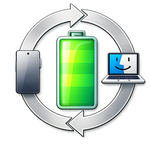
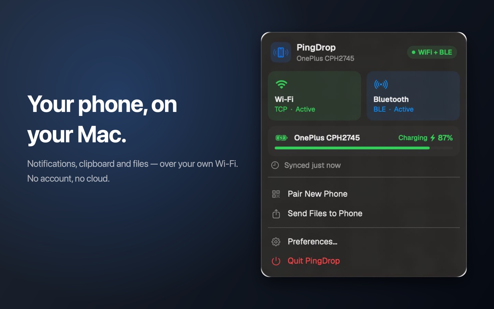
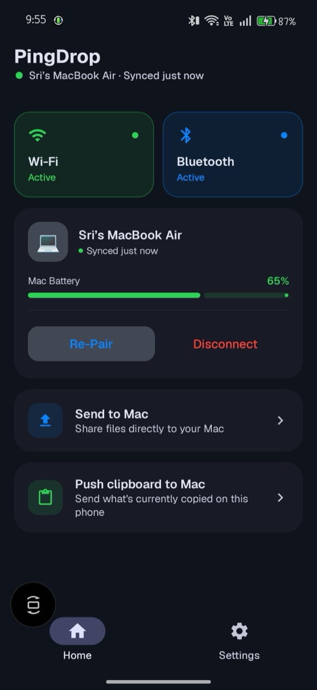
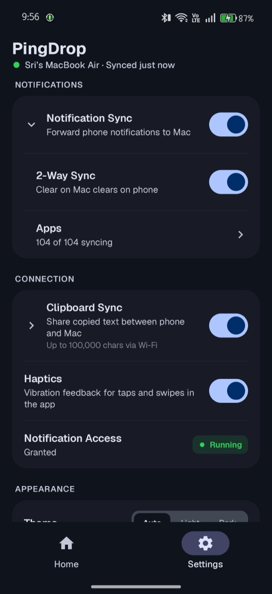
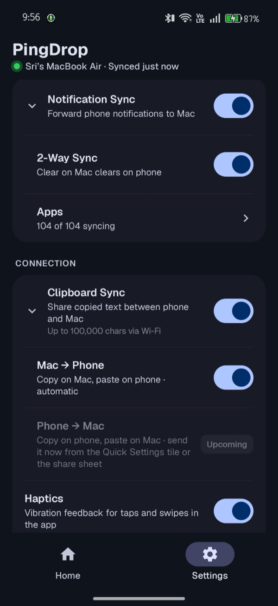
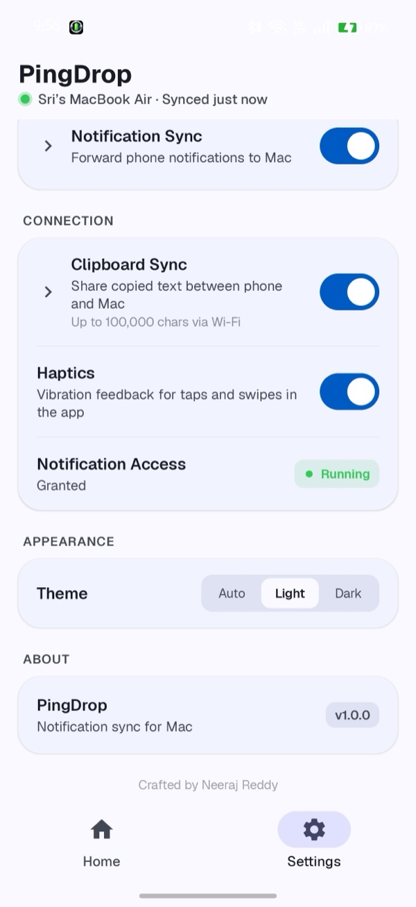

# PingDrop

**Your Android phone, on your Mac.** 
Notifications, clipboard and files — over your own Wi-Fi. No account. No cloud.

  

&nbsp;

[Download](#download) · [Getting started](#getting-started) · [Privacy](#privacy) · [Troubleshooting](#troubleshooting) · [Report a bug](https://github.com/Neeraj-Nani/Pingdrop/issues)

 

> [!NOTE]
> The Android app is live on Google Play. The Mac app is in final review and will be
> published here under [Releases](https://github.com/Neeraj-Nani/Pingdrop/releases) —
> click **Watch → Custom → Releases** at the top of this page to get notified.

---

## What it does

**Notifications on your Mac.** Messages, mail, anything on your phone shows up on
your desktop. You choose which apps are allowed, one by one. Dismiss a notification
on the Mac and it clears on the phone too.

**Clipboard, both ways.** Copy on the Mac, paste on the phone. Copy on the phone and
send it over from the Quick Settings tile or the share sheet. Each direction has its
own switch.

**Files, both ways.** Drag files onto the PingDrop icon in your menu bar to send them
to your phone, or share from any Android app to your Mac. Transfers show live
progress and land in Downloads.

**Battery at a glance.** Your phone's charge in the Mac menu bar, your Mac's charge in
the phone's notification shade.

**Stays connected.** Wi-Fi when both devices are on the same network, Bluetooth LE
when they aren't. Reconnects on its own when you get home, wake your Mac or unlock
your phone.

## Screenshots

  
  
  
  

## Download

| Platform | Get it | Version |
|---|---|---|
| **Android** | [Google Play](https://play.google.com/store/apps/details?id=com.app.pingdrop) |  |
| **Mac** | Coming soon to [Releases](https://github.com/Neeraj-Nani/Pingdrop/releases) | — |

PingDrop is free. The Android app shows one small banner ad, which a one-time
**PingDrop Pro** purchase removes.

## Getting started

1. **On your phone** — install PingDrop from
   [Google Play](https://play.google.com/store/apps/details?id=com.app.pingdrop).
2. **On your Mac** — download `PingDrop.dmg` from
   [Releases](https://github.com/Neeraj-Nani/Pingdrop/releases), open it, and drag
   PingDrop into **Applications**.
3. Open PingDrop on the Mac. It lives in the **menu bar** at the top right, not in the
   Dock.
4. Click the menu bar icon → **Pair New Phone**. A QR code appears.
5. On the phone, tap **Pair with Mac** and scan the code. Allow notification access
   when asked.

Both devices should show **Wi-Fi + BLE** within a few seconds.

## Updating

- **Android** — updates arrive through Google Play like any other app.
- **Mac** — download the newest `PingDrop.dmg` from
  [Releases](https://github.com/Neeraj-Nani/Pingdrop/releases) and drag it into
  **Applications**, replacing the old copy. Your pairing is kept.

## Requirements

| | |
|---|---|
| Mac | macOS 14 Sonoma or later |
| Phone | Android 7.0 or later |
| Network | Same Wi-Fi network, or Bluetooth in range |

## Privacy

PingDrop is built so your data never has to leave your own devices.

- **No account, no server.** Your phone and your Mac talk directly to each other over
  your local network or Bluetooth. There is nothing in between to store or read your
  data.
- **Encrypted end to end.** Pairing exchanges an AES-256 key through the QR code, and
  everything after that is encrypted with it (AES-256-GCM). The key never leaves the
  two devices.
- **The Mac app makes no internet connections at all.**
- **The Android app shows a small banner ad** from Google AdMob, which does use the
  internet. PingDrop never passes your notifications, clipboard or files to the ad
  network. A one-time **PingDrop Pro** purchase removes the ad.
- Clipboard items your password manager marks as sensitive are never sent.

Full privacy policy: **https://neeraj-nani.github.io/Pingdrop/**

## Troubleshooting

**The phone won't connect.**
Check both devices are on the same Wi-Fi network, Bluetooth is on, and PingDrop is
running on the Mac — look for its icon in the menu bar. Opening PingDrop on the phone
once also wakes it up.

**Notifications stop after a while.**
Some Android phones stop background apps to save battery. If PingDrop shows
**Battery Optimization Active**, tap **Fix** and let it run unrestricted.

**The Mac asks to find devices on your local network.**
Allow it. That is how the Mac reaches your phone — PingDrop only ever talks to the
phone you paired.

**Can I pair more than one phone?**
One phone per Mac. **Pair New Phone** replaces the current one.

## Support

Found a bug or have an idea? [Open an issue](https://github.com/Neeraj-Nani/Pingdrop/issues)
or email **pingdrop.support@gmail.com**.

PingDrop is free. If it saves you a few trips to your phone, you can support its
development at [Buy Me a Coffee](https://buymeacoffee.com/neerajreddy).

---

© 2026 Neeraj Reddy. All rights reserved. PingDrop is free to download and use;
its source code is not published. Android and Google Play are trademarks of Google LLC.
Mac and macOS are trademarks of Apple Inc.
